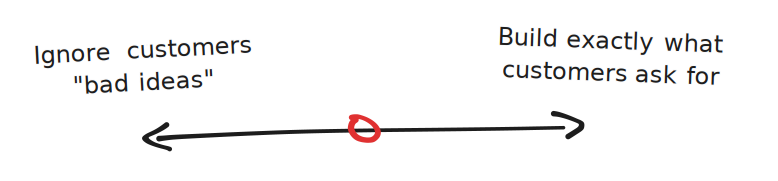

While I was at [Buffer](https://buffer.com), I led a team building an inbox tool for social media. It was used by teams at Stripe, Slack, and DigitalOcean to manage @mentions, comments, and DMs at scale.

One of the more tedious parts of our customer's workflow was answering the same questions repeatedly. So naturally it wasn’t long before we got feature requests for things like canned responses or automated replies.

I had a visceral reaction to building a feature that could enable sending tons of spammy or inauthentic messages at scale – let alone in a public forum like social media.

Customers wanted to speed up their agent's workflow and improve consistency in responses. That seemed fair! But I hated the idea of canned responses. I didn’t want our customers to want this feature. "Do better!" I thought. 

**My ego was showing.**

I started to ignore the feature requests. For a little while, at least.

But soon I noticed customers had started working around us and solving the problem on their own. Some copied and pasted responses from shared docs or Slack messages, while others actually started paying for (!!!) third-party apps like TextExpander.

This should have been an obvious green flag. When a customer solves a problem on their own, it's the best validation you can get as a product builder. Stupidly, though, it took a few customers nearly churning for this insight to actually sink in.

When I eventually got off my "high horse" and stopped passing judgment on how I wanted our customers to use the product, the team and I shipped Saved Replies. This let agents pull from a shared team library of snippets and insert them into their responses.

Was it the fully automated or bulk feature our customers had asked for? No. But it did solve the most critical part of their problem – saving them time and improving consistency in responses.

Thinking back on this experience, I've come to visualize it on a spectrum: 

On the far left, your ego takes over and you dismiss customer requests out of hand. "They shouldn't want this" or "they don't know what's good for them". 

On the far right, you blindly build whatever customers ask for. You don't think through the second order consequences or take into consideration the larger picture. 

The hard part of course is doing something in the middle – solving customer's problems _while_ being opinionated about the world you want to exist. 

Building the right thing is hard. But it's waaay harder when we're passing judgment on what we think customers should want.